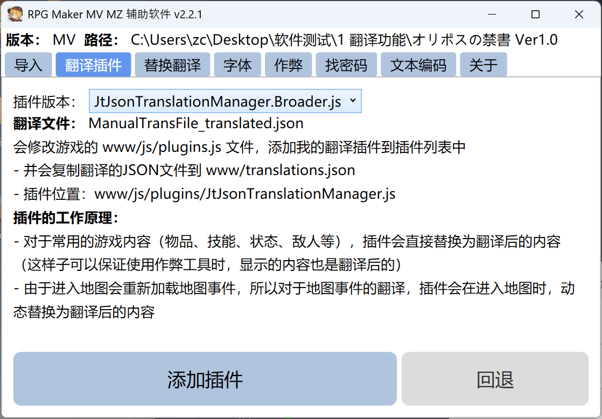

# RPG Maker MV MZ 帮助软件

本版本使用 .NET Framework 4.8 编写，支持 RPG Maker MV 和 RPG Maker MZ 的游戏。

## 功能

1. 加载 MTools 的翻译 json 文件，并修改 data/*json 文件 和 js/plugins.js 文件
2. 修改字体 （复制系统字体到 www/Fonts，并修改CSS）
3. 添加作弊，使用的是 paramonos/RPG-Maker-MV-MZ-Cheat-UI-Plugin 的代码
4. 找游戏的宝箱密码
5. 自动识别txt文件的编码格式，并转换为 UTF-8

## 使用方法

1. 直接下载 exe 文件
2. 运行 exe 文件
3. 选择游戏目录 和/或 翻译文件(json)
4. 点击修改按钮
5. 等待修改完成



# 原理

- data/*json 包含了所有的游戏数据
- js/plugins.js 包含了所有的插件配置

只需要翻译 data/*json 文件 和 js/plugins.js 文件即可

需要翻译的字段有：

- `<Object>.json` (`Actors.json`, `Armors.json`, `Classes.json`, `Enemies.json`, `Items.json`, `MapInfos.json`, `Skills.json`, `States.json`, `Weapons.json`)
  - `name`, `description`, `profile` and some `note`
- `events.json` (`MapXXX.json`， `CommonEvents.json`)
  - 对话、背景和选项 `code`: `101`，`401`, `102`，`402`, `405` 翻译所有 `parameters`
  - 插件编码 `code`: `356` 和 `357` 使用白名单进行翻译
- `js/plugins.js`
  - 通过白名单进行翻译

```json
// 356 example
{
    "code": 356,
    "indent": 1,
    // D_TEXT is the plugin name
    "parameters": ["D_TEXT こんだけ注目集めといてSじゃなかったら・・・ 12"]
}

// 357 example
{
  "code": 357,
  "indent": 0,
  "parameters": [
    // DTextPicture is the plugin name
    "DTextPicture",
    "dText",
    "文字列ピクチャ準備",
    { "text": "ロレンチア\n", "fontSize": "0" }
  ]
}
```

# 鸣谢

1. 感谢 davide97l/rpgmaker-mv-translator 提供的思路
2. 感谢 paramonos/RPG-Maker-MV-MZ-Cheat-UI-Plugin 提供的作弊代码

